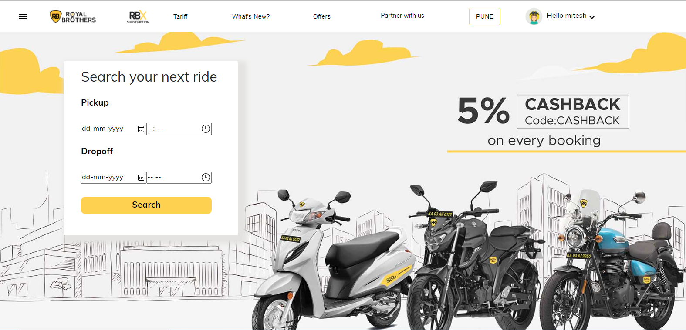
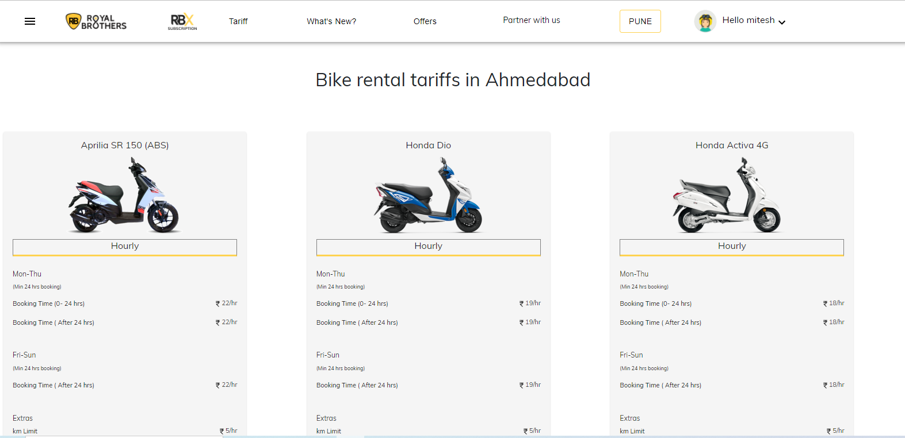
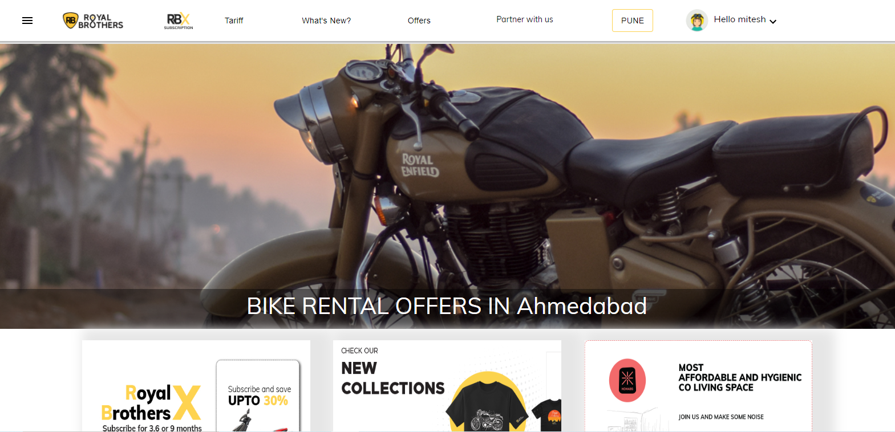
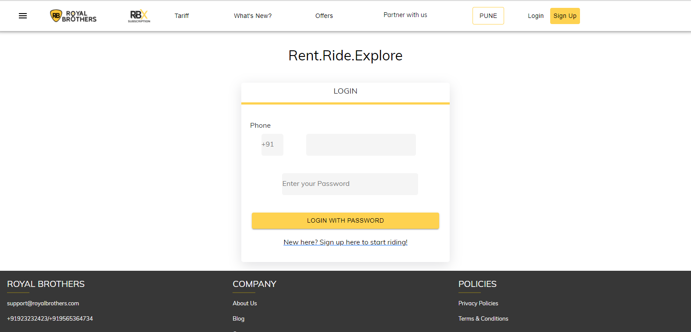

# Royal Brother Clone
This repository is for developing the Royal Brother clone.

# What is Royal Brother?

Royal Brothers is a bike and car rental company in India. A company that started in 2015 is known for quality and services

## Tech Stacks Used:
 
- **React Js**
- **Redux**
- **JSON server**
- **MUI**

### **Home page**
It is Our Landing Page.

 

### **Tariff page:**
It is the Tariff Page, There is show so Low to high & high to Low cost of Travel.

 

### **Offer:**

It is very intersting page, there are many offer for you

 

### **Earn with us**

it Is Earn page , there are so Source of income for you .

 

### **Login**

It os our Login Page .

 

## Contributers

 👤 **MD Amanullah**

- Github: [MD Amanullah](https://github.com/Amanullah21)
- Linkedin: [MD Amanullah](https://www.linkedin.com/in/Amanullah21)

👤 **Mitesh Sharma**

- Github: [Mitesh Sharma](https://github.com/ms00110011)
- Linkdin:[Mitesh Sharma](https://www.linkedin.com/in/miteshsharma1/)

👤 **Manoj Kumar Nishad**

- Github: [Manoj](https://github.com/amnishad0512)
- Linkedin: [Manoj](https://www.linkedin.com/in/amnishad0512/)

